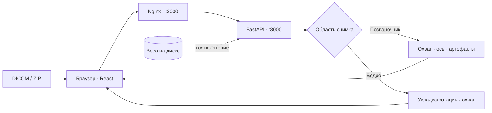

<p align="center">
  
</p>
<h1 align="center">DEXQ</h1>
<p align="center"><strong>Локальный контроль качества DXA-исследований</strong><br>Позвоночник и бедро · анализ на CPU · отчёт для специалиста</p>
<p align="center">
  <a href="https://droyti46.github.io/dexq/">Документация</a> ·
  <a href="https://droyti46.github.io/dexq/start/">Запуск</a> ·
  <a href="https://droyti46.github.io/dexq/ui/">Интерфейс</a> ·
  <a href="https://droyti46.github.io/dexq/api/">API</a>
</p>

<p align="center">
  <a href="docs/images/01-landing.png"></a>
</p>

## О решении

DEXQ принимает DXA-исследования в DICOM, определяет анатомическую область и локально оценивает качество снимка до просмотра специалистом. Сервис работает на CPU; снимки передаются только локальному серверу DEXQ, не во внешние сервисы. **Это исследовательский инструмент, не диагноз и не клинически валидированное медицинское изделие.** [Подробнее о решении →](https://droyti46.github.io/dexq/)

## Возможности

Позвоночник: охват, наклон оси, артефакты. Бедро: общий флаг позиционирования/ротации и оценка охвата ROI. В интерфейсе есть проекты, пакетная загрузка, просмотр ориентиров и сохранение ручной правки оси; автоматический результат при этом не перезаписывается. [Проверки и интерфейс →](https://droyti46.github.io/dexq/ui/workspace/)

<table>
  <tr>
    <td width="50%"><a href="docs/images/05-workspace-tilted.png"></a></td>
    <td width="50%"><a href="docs/images/07-workspace-hip.png"></a></td>
  </tr>
  <tr><td>Позвоночник: ось и отдельные проверки</td><td>Бедро: укладка и охват поля</td></tr>
</table>

Скриншоты сняты на обезличенных демонстрационных исследованиях, уже приведённых в документации. Они показывают интерфейс, а не качество на независимой выборке.

## Ограничения

Метрики получены на development-наборе, а не на независимых пациентах. Проекция AP/PA отображается только при явном теге DICOM `ViewPosition`; ротация бедра отдельно от позиционирования не распознаётся, отступы ROI в сантиметрах не измеряются. Правило ручного угла 5° — эвристика; медицинский итог остаётся за специалистом. [Модель и границы интерпретации →](https://droyti46.github.io/dexq/model/)

## Структура проекта

```text
backend/                 FastAPI, проверки, эталонный runtime и тесты
backend/models/reference/  локальные веса и манифест (не входят в Git)
frontend/                React, TypeScript и Nginx
docs/                    документация и скриншоты
scripts/                 подготовка весов и запуск
docker-compose.yml        сервер и веб-интерфейс
```

Веса подключаются к backend-контейнеру только для чтения; состояние проектов и ручные правки живут в памяти вкладки браузера. [Устройство кода →](https://droyti46.github.io/dexq/code/)



## Системные требования и зависимости

Для контейнеров нужны Linux с Docker Engine и Compose (либо macOS/Windows с работающим Docker Desktop), Python 3 для предварительной проверки весов и примерно 4 ГБ ОЗУ; GPU не требуется. Для запуска без Docker — Python 3.12 и Node.js 22. Зависимости закреплены в `backend/requirements.lock`, `frontend/package-lock.json` и digest базовых образов. [Требования и зависимости →](https://droyti46.github.io/dexq/start/) · [Образы и офлайн-ограничения →](https://droyti46.github.io/dexq/start/offline/)

## Quick Start: Docker

**Два разных источника:** комплект `dexq.zip` может включать готовый каталог `backend/models/reference/` с манифестом; **GitHub-репозиторий весов не содержит**. Для клона из GitHub сначала [установите модели](https://droyti46.github.io/dexq/start/weights/) из локального эталонного архива. Первая сборка Docker требует доступ к образам и зависимостям из сети или подготовленного кэша — передача папки сама по себе не гарантирует офлайн-сборку.

Из корня распакованного комплекта на Linux/macOS:

```bash
sh scripts/run.sh
```

Скрипт проверяет SHA-256 весов и выполняет `docker compose up --build`. Через `sh` он запускается и из Git, где файл не помечен исполняемым. На Windows при работающем Docker Desktop задайте `$env:DEXQ_MODELS_DIR = (Resolve-Path .\backend\models\reference).Path` и выполните `docker compose up --build`. [Пошаговый запуск и проверка healthcheck →](https://droyti46.github.io/dexq/start/docker/)

| Сервис | Локальный адрес |
| --- | --- |
| Сайт | <http://localhost:3000> |
| Swagger UI | <http://localhost:8000/docs> |
| Готовность моделей | <http://localhost:8000/api/v1/health> |

**Проверено 29.09.2026:** текущие frontend/backend собраны через Docker Compose в локальной Ubuntu Server 24.04.5 VM; backend `healthy`, страницы и API доступны через Nginx. Обезличенный development-снимок с синтетическими UID дал `Success`; ZIP с ним вернул поток результатов и официальный CSV с относительным путём и восьмью колонками. Это подтверждает работу **на этой VM**, но не чистую офлайн-установку или точность на закрытом наборе. [Проверка контейнеров →](https://droyti46.github.io/dexq/start/docker/) · [Ограничения офлайн-поставки →](https://droyti46.github.io/dexq/start/offline/)

## API

`GET /api/v1/health` проверяет готовность; `POST /api/v1/analyses` принимает один файл. `/analyses/batch` обрабатывает до 200 файлов, `/analyses/archive.stream` — ZIP до 1000 изображений с поэлементным результатом; доступны также JSON и CSV-маршруты. [Все маршруты и примеры запросов →](https://droyti46.github.io/dexq/api/)

## Входные и выходные данные

Вход: однокадровый одноканальный 8-bit `MONOCHROME2` DICOM; grayscale PNG — для технического демо, одиночный JPEG сайт преобразует локально. Выход: JSON для изображения или CSV/XLSX — одна строка на завершённый снимок, включая `Failure`. Официальный файл содержит **ровно восемь полей задания**, исходный путь ZIP и UID из DICOM; отдельный отчёт врача включает сохранённые ручные ориентиры. [Формат ответа →](https://droyti46.github.io/dexq/api/schemas/) · [CSV и Excel →](https://droyti46.github.io/dexq/ui/export/)

## Модель, предобработка и результат

Локальный ONNX runtime выбирает область и запускает применимые проверки. Для оси позвоночника кадр масштабируется до 512×512, для бедра используется letterbox 320×320; исходные пиксели DICOM не переписываются. На выходе применимые проверки сводятся к классу `1` при нарушении и `0` при полной оценке без нарушений; неопределённая обязательная проверка даёт `Failure` без класса. Версии весов, SHA-256, нормализация и пороги описаны в разделе [Модель и пред-/постобработка →](https://droyti46.github.io/dexq/model/).

## Известные ошибки и их обработка

Повреждённый/неподдерживаемый DICOM, недоступные веса или превышенный лимит дают понятную ошибку; пакет сохраняет отдельную строку `Failure` вместо потери остальных результатов. `/health` возвращает 503 при недоступности модели, одиночный анализ — 422 для неподходящего входа. Незавершённый поток ZIP не считается готовым отчётом. [Ошибки и восстановление →](https://droyti46.github.io/dexq/start/troubleshooting/) · [Контракт API →](https://droyti46.github.io/dexq/api/)

## Documentation и проверка кода

Полные инструкции по [запуску](https://droyti46.github.io/dexq/start/), [интерфейсу](https://droyti46.github.io/dexq/ui/), [API](https://droyti46.github.io/dexq/api/), [модели](https://droyti46.github.io/dexq/model/) и [структуре кода](https://droyti46.github.io/dexq/code/) доступны в MkDocs. Проверка изменений: `pytest` и `ruff check .` из `backend/`, `npm run build` и Node-тесты из `frontend/`. [Команды и методика →](https://droyti46.github.io/dexq/code/testing/)

<sub>Команда «Люди в черном».</sub>
