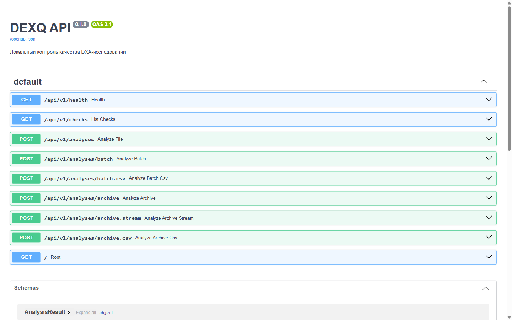

# API

<p class="lead">DEXQ можно встроить в другую систему через HTTP. Сервер принимает снимки в виде <code>multipart/form-data</code> и отвечает в JSON или CSV. Сайт DEXQ пользуется этим же API.</p>

| Параметр | Значение |
| --- | --- |
| Базовый адрес | `http://localhost:8000/api/v1` |
| Интерактивная документация | <http://localhost:8000/docs> (Swagger UI) |
| Схема OpenAPI | <http://localhost:8000/openapi.json> |
| Авторизация | Нет: сервер рассчитан на работу внутри локальной сети |
| Формат запроса | `multipart/form-data` |
| Формат ответа | JSON, CSV или NDJSON (поток) |

<figure markdown>

<figcaption>Swagger UI: каждый метод можно вызвать прямо из браузера кнопкой «Try it out».</figcaption>
</figure>

## Первый запрос за минуту

<div class="steps" markdown>

1. **Проверьте, что сервер готов:**

    ```bash
    curl http://localhost:8000/api/v1/health
    ```

    ```json
    {"status": "ready", "service": "DEXQ API", "version": "0.1.0"}
    ```

2. **Отправьте снимок:**

    ```bash
    curl -F "file=@study.dcm" http://localhost:8000/api/v1/analyses
    ```

3. **Прочитайте итог** в полях `processing_status`, `quality_class` и `violation_types`:

    ```json
    {
      "processing_status": "Success",
      "anatomical_region": "lumbar_spine",
      "quality_class": 1,
      "violation_types": ["spine_axis"],
      "time_of_processing": 2.3715
    }
    ```

</div>

## Все методы

| Метод | Путь | Что делает |
| --- | --- | --- |
| <span class="http get">GET</span> | [`/health`](endpoints.md#health) | Готовность сервера и моделей |
| <span class="http get">GET</span> | [`/checks`](endpoints.md#checks) | Список проверок качества |
| <span class="http post">POST</span> | [`/analyses`](endpoints.md#analyses) | Анализ одного файла → JSON |
| <span class="http post">POST</span> | [`/analyses/batch`](endpoints.md#batch) | Пакет до 200 файлов → JSON |
| <span class="http post">POST</span> | [`/analyses/batch.csv`](endpoints.md#batch-csv) | Пакет до 200 файлов → CSV |
| <span class="http post">POST</span> | [`/analyses/archive`](endpoints.md#archive) | ZIP до 1000 снимков → JSON |
| <span class="http post">POST</span> | [`/analyses/archive.csv`](endpoints.md#archive-csv) | ZIP до 1000 снимков → CSV |
| <span class="http post">POST</span> | [`/analyses/archive.stream`](endpoints.md#archive-stream) | ZIP → поток результатов по мере готовности |

## Общие правила

**Область снимка.** Все методы анализа принимают необязательное поле формы `anatomical_region`:

| Значение | Поведение |
| --- | --- |
| `auto` (по умолчанию) | Область определяет модель-роутер по изображению |
| `lumbar_spine` | Снимок считается поясничным отделом, роутер не вызывается |
| `proximal_femur` | Снимок считается бедром, роутер не вызывается |

**Ошибки.** При ошибке сервер отвечает JSON вида `{"detail": "понятный текст"}`:

| Код | Когда |
| --- | --- |
| `422` | Файл повреждён, формат не поддерживается, превышен размер или число файлов, модель не дала решения |
| `503` | Модели не установлены или повреждены (только `/health`) |

Пакетные методы не падают из-за одного плохого файла: ошибка записывается в строку этого файла, остальные обрабатываются.

**Ограничения.**

| Что | Предел | Настройка |
| --- | --- | --- |
| Один файл | 50 МБ | `DEXQ_MAX_UPLOAD_MB` |
| ZIP-архив | 1024 МБ | `DEXQ_MAX_ARCHIVE_MB` |
| Файлов в пакете | 1–200 | — |
| Изображений в ZIP | до 1000, до 2 ГБ после распаковки | — |

**Параллельность.** Модели загружены в одном экземпляре, и вызовы выполняются по очереди. Одновременные запросы не ломают друг друга, но и не ускоряются.

**Приватность.** Сервер не хранит файлы и не пишет их в базу. Персональные DICOM-теги (имя, дата рождения, ID пациента) в ответ не попадают — только Study UID и Image UID.
