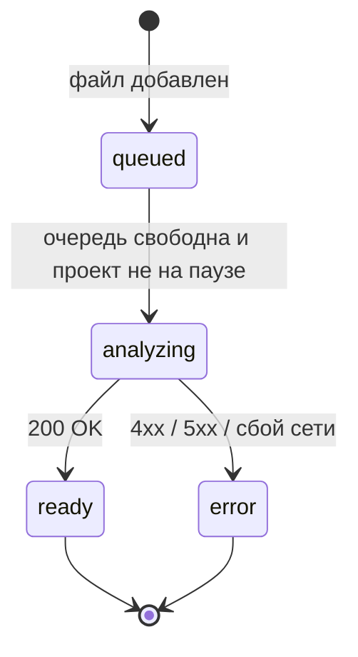

# Frontend

Сайт — одностраничное приложение на React 18 и TypeScript в строгом режиме. Сборка — Vite, маршрутизация — React Router. Глобального state manager и UI-kit нет: состояние проектов хранится в одном React-контексте, стили написаны вручную.

## Страницы

| Маршрут | Компонент | Что показывает |
| --- | --- | --- |
| `/` | `pages/LandingPage.tsx` | Лендинг с видео и витриной интерфейса (`AppShowcase`) |
| `/projects` | `pages/ProjectsPage.tsx` | Список проектов и создание нового |
| `/projects/:projectId` | `pages/WorkspacePage.tsx` | Рабочее пространство проекта |
| `/about` | `pages/AboutPage.tsx` | «Как это работает» |
| `/team` | `pages/TeamPage.tsx` | Команда |
| `/analyze`, `/result` | — | Старые адреса, перенаправляют на `/projects` |

`AnalyzePage.tsx` и `ResultPage.tsx` остались от первой версии интерфейса и в маршрутах не используются.

## Компоненты

| Компонент | Назначение |
| --- | --- |
| `ProjectProvider` | Контекст всех проектов: очередь анализа, добавление и удаление снимков, пауза, ручные оси и их история |
| `StudyViewer` | Просмотрщик: масштаб, перемещение, яркость/контраст, SVG-наложение оси и ориентиров, перетаскивание точек |
| `DropdownMenu` | Меню «Файл», «Правка», «Редактор» с клавиатурной навигацией |
| `MarqueeList` | Список снимков с выделением рамкой |
| `PanelDivider` | Перетаскиваемый разделитель панелей |
| `ProjectDialog` | Диалог создания проекта |
| `AppShell`, `AppShowcase`, `Icon` | Общая шапка, витрина на лендинге, набор SVG-иконок |

## Логика без React

Правила, которые проще тестировать отдельно, вынесены в обычные модули с тестами рядом (`*.test.ts`):

| Модуль | Что делает |
| --- | --- |
| `api.ts` | Запросы к API: один файл, пакет, потоковое чтение ZIP (NDJSON). JPEG перед отправкой конвертируется в PNG на `<canvas>` |
| `projects.ts` | Типы проекта и снимка, лимит 1000 снимков, добавление и удаление, выделение диапазоном, CSV-выгрузка |
| `manualAxis.ts` | Применение ручной оси к результату, предупреждения перед экспортом, таблица отчёта для организаторов и врача |
| `geometry.ts` | Угол оси и правило «> 5° — нарушение», перевод координат курсора в пиксели снимка |
| `axisHistory.ts` | Стек отмены и повтора правок оси |
| `report.ts` | Excel-отчёт через `write-excel-file` |
| `results.ts` | Хранение результата для старой страницы `ResultPage` (не используется в рабочем пространстве) |
| `viewTransform.ts` | Масштаб от 0,25× до 8× относительно курсора |
| `workspaceInteractions.ts` | Выделение рамкой, допустимая ширина панелей, приблизительный прогресс анализа |
| `types.ts` | Типы ответа API — зеркало `backend/app/schemas.py` |

## Очередь анализа

`ProjectProvider` берёт первый снимок в статусе `queued` из первого проекта не на паузе и отправляет его на сервер. Одновременно обрабатывается один снимок — так сервер не перегружается, а порядок результатов совпадает с порядком загрузки. ZIP отправляется целиком на `/archive.stream`: каждое событие `started` добавляет снимок в список, событие `result` заполняет его.

Удаление снимка во время анализа отменяет запрос через `AbortController`. Ссылки `blob:` на превью освобождаются при удалении и при закрытии приложения.

## Ручная ось

Ручная ось хранится в проекте отдельно от ответа сервера: `manualAxes[itemId]` — сохранённое значение, черновик живёт в `WorkspacePage`. Функция `resultWithSavedAxis` строит «виртуальный» результат: заменяет только проверку `spine_axis` (метод `manual_axis_heuristic`), пересчитывает `violation_types` и `quality_class`. Исходный ответ модели не изменяется и всегда доступен для сравнения.

## Стили

- `styles.css` — общие стили, лендинг, страницы проектов; цвета в CSS-переменных (`--blue: #0202f1`, `--ink`, `--muted`…).
- `workspace.css` — графитовая тема рабочего пространства (`--work-bg: #191b1e`, `--work-panel: #222529`, `--work-accent: #92accb`…).
- Шрифт — Evolventa (обычный и жирный), лежит в `public/fonts/`.

## Сборка и прокси

| Режим | Как попадают запросы к `/api` |
| --- | --- |
| `npm run dev` | Прокси Vite на `http://127.0.0.1:8000` (`vite.config.ts`) |
| Docker | Nginx проксирует `/api/` на `backend:8000` без буферизации — это нужно для потока NDJSON (`nginx.conf`) |

`npm run build` сначала проверяет типы (`tsc -b`), затем собирает статику в `dist/`.
