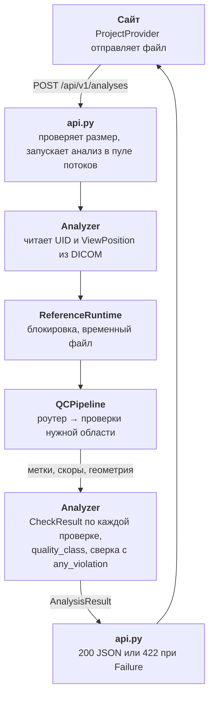

# Устройство кода

<p class="lead">Репозиторий — монорепо из двух приложений: сервера анализа на Python и сайта на React. Модельное ядро взято из эталонного решения без изменений и подключается как отдельный пакет.</p>

## Структура репозитория

```text
dexq/
├── backend/                  сервер анализа (Python 3.12, FastAPI)
│   ├── app/                  код сервиса: API, оркестрация, форматы
│   ├── reference/combined_qc/  модельное ядро эталона (не редактируется)
│   ├── models/reference/     веса моделей — в .gitignore, ставятся скриптом
│   ├── tests/                pytest
│   ├── Dockerfile
│   ├── pyproject.toml        зависимости и настройки ruff
│   └── requirements.lock     точные версии для Docker
├── frontend/                 сайт (React 18, TypeScript, Vite)
│   ├── src/                  страницы, компоненты, логика
│   ├── public/               шрифты Evolventa, демо-видео
│   ├── nginx.conf            раздача статики и прокси /api/
│   └── Dockerfile
├── scripts/                  установка весов, запуск, бенчмарк, метрики, упаковка
├── docs/                     эта документация (MkDocs Material)
├── docker-compose.yml
└── mkdocs.yml
```

## Как проходит один снимок



1. Сайт отправляет файл и выбранную область (по умолчанию `auto`).
2. `api.py` читает загрузку с ограничением размера и передаёт байты в `Analyzer` в пуле потоков, чтобы не блокировать сервер.
3. `Analyzer` достаёт из DICOM только UID и `ViewPosition`; явная проекция не AP/PA сразу даёт `Failure`.
4. `ReferenceRuntime` под блокировкой пишет временный файл и вызывает эталонный `QCPipeline`; файл удаляется сразу после вызова.
5. `Analyzer` превращает метки эталона в `CheckResult`, считает итог и сверяет его с флагом `any_violation` эталона.
6. Ответ уходит на сайт: `200` с результатом или `422` с причиной.

## Ключевые решения

**Модель не переписывается.** Код `backend/reference/combined_qc/` побайтово совпадает с эталонным архивом. Сервис вызывает его «как есть» через `ReferenceRuntime` и только переводит ответ в собственный контракт. Благодаря этому метрики эталона относятся ровно к тому коду, который работает в DEXQ.

**Нет запасной модели.** Если веса не прошли проверку SHA-256 или модель не дала решения, результат — `Failure`, а не ответ упрощённой эвристики. Для медицинского контроля качества молчаливая подмена хуже честной ошибки.

**Ничего не хранится.** В сервисе нет базы данных: файл живёт в памяти запроса, временная копия удаляется сразу после инференса. Проекты на сайте — только в памяти вкладки браузера.

**Персональные теги не выходят наружу.** Из DICOM читаются только StudyInstanceUID, SOPInstanceUID и ViewPosition. Имя, дата рождения и ID пациента в ответ не попадают.

**Детерминизм.** Один и тот же файл даёт один и тот же ответ: модели работают в режиме инференса на CPU, `analysis_id` вычисляется из содержимого файла.

## Технологии

| Часть | Стек |
| --- | --- |
| Backend | Python 3.12, FastAPI, Pydantic 2, Uvicorn, pydicom, Pillow, NumPy, ONNX Runtime (CPU) |
| Frontend | React 18, TypeScript (strict), Vite 8, React Router 7, write-excel-file |
| Развёртывание | Docker Compose, Nginx 1.27 |
| Качество | pytest, ruff, `node --test`, `tsc` |

Подробнее — [Backend](backend.md), [Frontend](frontend.md), [Тесты и проверки](testing.md).
