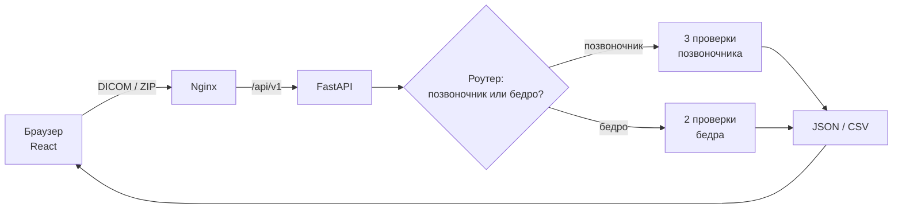

---
hide:
  - navigation
  - toc
---

Интеллектуальный контроль качества DXA

<h1 class="wordmark">DEXQ</h1>

Проверяет снимки денситометрии поясничного отдела и бедра: укладку, наклон оси, артефакты и охват зоны интереса. Работает локально на процессоре, без отправки снимков в интернет.

[Запустить за 5 минут](start/index.md){ .md-button .md-button--primary }
[Как пользоваться сайтом](ui/index.md){ .md-button }
[API](api/index.md){ .md-button }

## С чего начать

-   :material-rocket-launch-outline:{ .lg .middle } **Запуск**

    ---

    Подготовить веса моделей и поднять DEXQ в Docker одной командой или без Docker — в двух терминалах.

    [:octicons-arrow-right-24: Инструкция по запуску](start/index.md)

-   :material-monitor-dashboard:{ .lg .middle } **Сайт**

    ---

    Проекты, загрузка снимков, просмотр результатов, ручная правка оси позвоночника и выгрузка CSV/Excel.

    [:octicons-arrow-right-24: Руководство пользователя](ui/index.md)

-   :material-api:{ .lg .middle } **API**

    ---

    HTTP-интерфейс для интеграции: один файл, пакет до 200 файлов или ZIP до 1000 снимков. Ответ в JSON или CSV.

    [:octicons-arrow-right-24: Описание API](api/index.md)

-   :material-code-braces:{ .lg .middle } **Код**

    ---

    Как устроены backend на FastAPI и frontend на React, куда смотреть при изменениях и как запускать тесты.

    [:octicons-arrow-right-24: Устройство кода](code/index.md)

## Что делает DEXQ

<figure markdown>

<figcaption>Рабочее пространство. Слева — снимки проекта, в центре — изображение с найденной осью позвоночника, справа — итог и отдельные проверки. На скриншотах документации только синтетические фантомы, а не снимки пациентов.</figcaption>
</figure>

Вы загружаете DICOM-файлы исследований. DEXQ сам определяет, что на снимке — поясничный отдел позвоночника или проксимальный отдел бедра, — и запускает проверки для этой области:

| Область | Проверка | Что ищет |
| --- | --- | --- |
| Позвоночник | Охват позвоночника | В кадр попали нужные позвонки и соседние структуры |
| Позвоночник | Наклон оси позвоночника | Ось позвоночника отклонена от вертикали больше чем на 5° |
| Позвоночник | Артефакты позвоночника | Посторонние предметы и помехи в зоне измерения |
| Бедро | Позиционирование / ротация бедра | Нога уложена или повёрнута неправильно (один общий флаг) |
| Бедро | Охват ROI бедра | Область интереса бедра попала в кадр не полностью |

Для каждого снимка вы получаете итог **«норма» / «есть нарушение»**, список нарушений, координаты найденных ориентиров и время обработки. Результаты выгружаются в CSV в формате задания или в Excel-отчёт для врача.

!!! warning "Это исследовательский инструмент, а не медицинское изделие"
    Модели обучены и проверены на небольшом наборе из 255 снимков (102 исследования). Метрики получены на тех же данных, поэтому их нельзя считать независимой клинической проверкой. Правило наклона оси — **эвристика** с порогом 5°. Решение о качестве снимка принимает специалист. Подробно — в разделе [Модель и метрики](model/index.md).

## Коротко об устройстве

Всё работает на одной машине: веса моделей лежат локально, инференс идёт на процессоре через ONNX Runtime, видеокарта не нужна. Сервер не хранит снимки — каждый файл обрабатывается в памяти и сразу удаляется из временной папки.
