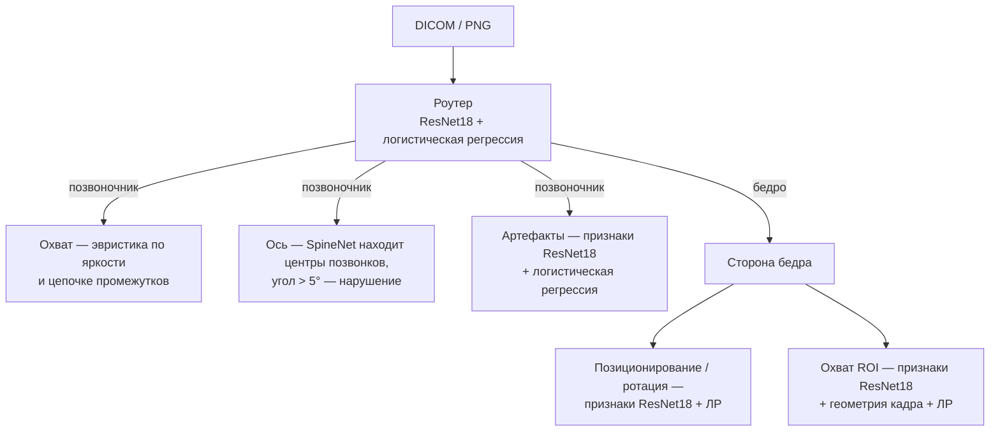

# Модель и границы интерпретации

DEXQ использует одно эталонное решение — набор нейросетей и простых классификаторов, которые работают на процессоре. Эта страница объясняет, как они принимают решение и где заканчивается то, что можно утверждать по имеющимся данным.

## Коротко

| Проверка | Метод | Тип |
| --- | --- | --- |
| `spine_positioning` | Яркость нижних боковых зон или длина цепочки межпозвоночных промежутков | **Эвристика** |
| `spine_axis` | SpineNet → центры позвонков → угол между верхним и нижним, порог 5° | Геометрия по детектору, порог — **эвристика** |
| `spine_artifacts` | Замороженный ResNet18 + морфологические признаки → классификатор | ML |
| `hip_positioning_rotation` | Замороженный ResNet18 → логистическая регрессия; правое бедро зеркалируется | ML, один общий флаг |
| `hip_roi` | ResNet18 + 7 признаков геометрии кадра → логистическая регрессия | ML, без сегментации |

!!! warning "Что нельзя утверждать"
    - Метрики получены на тех же 255 снимках, на которых обучались или настраивались модели. Это **не** независимая и не клиническая проверка — см. [Метрики](metrics.md).
    - Проекция AP/PA не определяется по изображению — только читается из тега `ViewPosition`.
    - Для бедра нет анатомической сегментации: рамка на снимке — граница светлой области, а поле в сантиметрах не измеряется.
    - Позиционирование и ротация бедра не различаются: разметка набора объединяет их в один класс.

## Подробно

**Источник единственный:** оптимизированный `dxa_qc_with_models (2).zip` (SHA-256 `b92ed6e89b1bb54358b1e06681842dbecac006880cf9062ea68980673ff12f0a`). 74 Python-файла `backend/reference/combined_qc/` совпадают с архивом побайтово. Скрипт `scripts/prepare_reference.py` устанавливает 22 проверенных runtime-файла (276 423 364 байта суммарно, включая JSON-манифесты) локально в `backend/models/reference/`; манифест хешей привязан к SHA этой поставки. Отдельные архивы hip, notebook-веса и файлы обучения **не** смешиваются с ней. Версии Python/библиотек и базовых образов см. в [офлайн-поставке](../start/offline.md).

### Цепочка инференса

Один загруженный `combined_qc.router.QCPipeline` автоматически определяет **анатомическую область** (spine/hip). После этого spine и hip-модули запускают применимые проверки; для бедра сторона определяется отдельной моделью по пикселям. Ручной выбор области в API минует router, но использует исходный профиль области и его веса. ONNX выполняется локально через `CPUExecutionProvider` с постоянными весами на процесс и синхронизацией вызовов. Временный исходный файл используется только потому, что runtime принимает путь; после каждого вызова он удаляется. Сервер не хранит исследование и ручные исправления.

- Позвоночник: `spine_positioning` — две детерминированные ветки по яркости и последовательности межпозвоночных промежутков; это **эвристика**, не доказанная идентификация Th12/подвздошной кости. Порог нижней ветки `-0.01941480441018939`, верхней `-4.228571428571429` (исходный `spine/engine/coverage.py`); верхняя ветка не назначает уровня позвонка. `spine_axis` — ONNX SpineNet с прямым bilinear resize **всего** нативного кадра до 512×512, повторением grayscale в три канала, нормализацией `float32/255 - 0.5`, пиками heatmap ≥0.2 и переносом центров в исходные пиксели. Угол по верхнему и нижнему центрам измеряется `abs(atan2(top.x - bottom.x, bottom.y - top.y))` в градусах; нарушение строго при `>5°`, равенство с допуском `1e-10` не считается нарушением. Отсутствие двух центров даёт неопределённое решение. `spine_artifacts` — фиксированный ResNet18 feature extractor, морфологические признаки и один числовой классификатор с порогом 0.5.
- Бедро: нативный одноканальный 8-bit grayscale DICOM `MONOCHROME2` или grayscale PNG; bilinear letterbox до 320×320 с чёрной рамкой. Один общий замороженный ResNet18 ONNX получает `uint8` letterbox (нормализация ImageNet внутри графа) и извлекает признаки качества. Два отдельных числовых логистических классификатора NPZ оценивают позиционирование/ротацию по 6400 признакам и охват по 512 признакам ONNX + 7 признакам исходной геометрии; для каждого применяется один порог (соответственно `0.6050538668300524` и `0.9035650425089169`, `models.json`). Правый hip зеркалируется **только** для признаков позиционирования, предполагаемая сторона определяется отдельной парой ResNet18 ONNX + NPZ из пикселей, а не по имени файла; это классификация по provisional-меткам набора, не анатомически подтверждённая сторона. В production нет ансамбля folds; cross-fit — отдельная внутренняя оценка рецепта, не проверка итоговых весов на независимом наборе. `hip_positioning_rotation` — **единый** флаг: разделить позиционирование и ротацию он не способен. `hip_roi` не использует анатомическую сегментацию: обученная оценка охвата опирается на признаки изображения и исходной геометрии; отображаемые фиксированные области и `foreground_bbox` — яркостные прокси, **не** анатомическая маска и не измерение запаса поля в сантиметрах.
- Итоговый `quality_class=1` при хотя бы одном нарушении, `0` только когда **все** обязательные применимые метки определены и равны `False`; при неизвестном обязательном решении статус `Failure` и класс пуст. Предупреждение `needs_review` выводится независимо от бинарного результата. Классификатор проекции не обучался: только явный DICOM `ViewPosition=AP/PA` даёт `projection=AP/PA` и `projection_source=dicom_view_position`; иначе остаётся `unknown`/`not_determined`. Сторона и область снимка не подменяют проекцию; явная иная ViewPosition отклоняется.

Исходная предобработка DICOM сохраняет исходные uint8-пиксели, без произвольного клинического windowing или смены полярности. Для неподдерживаемых фотометрических форматов/битности или повреждённых файлов не существует эвристического fallback. Ручной сдвиг двух реально обнаруженных точек позвоночника пересчитывает только отдельный клиентский угол; модельный вывод и пороги не меняются.

### Обучение, данные и ограничения

Архив включает код обучения, однако приложение его не запускает и веса при обслуживании не дообучаются. Как запустить обучение и конвертацию вручную — см. [Обучение и конвертация](training.md). Итоговые классификаторы hip обучены на всех доступных размеченных для своих задач снимках; классификатор артефактов spine — на 99 размеченных spine-изображениях. Архивный набор из 255 снимков содержит 102 исследования; экспертный QC-итог есть для 249 изображений. В архиве есть и описательный прогон итоговых весов по этому набору, и внутренняя grouped cross-fit оценка части рецепта; даже последняя **не** является независимой клинической валидацией полной системы: эвристика покрытия позвоночника и правило его угла разрабатывались на этих же данных. Числа и источники оценок см. в [метриках](metrics.md); не переносите показатели предыдущего архива на текущие веса. Проекция, анатомическая ROI-сегментация, отдельная классификация ротации и клинически значимая калибровка остаются вне фактически поставленного решения. Для пилотирования нужны новые обезличенные исследования, независимая экспертная оценка и заранее зафиксированные пороги.
