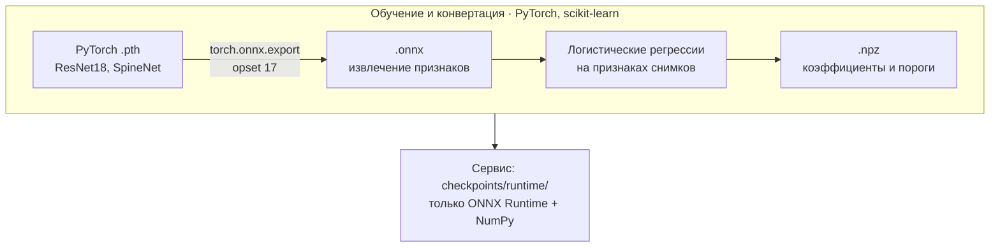

# Обучение и конвертация весов

<p class="lead">Для запуска DEXQ эта страница не нужна: в архиве лежат готовые веса. Она для тех, кто хочет переобучить классификаторы, заново сконвертировать сети из PyTorch в ONNX или проверить, как получены поставленные файлы.</p>

## Что именно обучается

Нейросети в DEXQ публичные и **заморожены**: ResNet18 (веса ImageNet из `torchvision`) и SpineNet (центры позвонков). Дообучения нейросетей нет. Обучаются только логистические регрессии поверх их признаков (`StandardScaler` + `LogisticRegression`, `class_weight="balanced"`), поэтому всё обучение идёт на CPU за минуты.



| Модель | Что обучается | Данные | Seed |
| --- | --- | --- | --- |
| Роутер области | ЛР по 512 признакам ResNet18, `C=0.1` | 255 снимков, позвоночник = 1 | 20260927 |
| Сторона бедра | ЛР по 2048 признакам ResNet18, `C=0.1` | 155 снимков бедра, правое = 1 | 20260927 |
| `hip_positioning_rotation` | ЛР по 6400 признакам, `C=0.01`, порог по кросс-фиту | размеченные снимки бедра | 20260928 |
| `hip_roi` | ЛР по 512 + 7 признакам геометрии, `C=0.01`, порог по кросс-фиту | размеченные снимки бедра | 20260927 |
| `spine_artifacts` | ЛР по 2680 признакам, `C=0.01`, порог 0,5 | 99 размеченных снимков позвоночника | 20260920 |

`spine_axis` и `spine_positioning` не обучаются: угол считается геометрически по центрам SpineNet, охват — **эвристика** с зафиксированными порогами.

!!! success "Почему ONNX, а не PyTorch"
    PyTorch нужен только при обучении и конвертации. В работающем сервисе его нет — там только ONNX Runtime и NumPy. Поэтому образ меньше, а те же файлы `.onnx`/`.npz` без изменений запускаются на Linux, Windows и macOS, на x86 и ARM, на CPU или на GPU (через провайдеры ONNX Runtime). Проверено: CPU, Windows 11 и Ubuntu 24.04.

## Перед началом

!!! warning "Два важных ограничения"
    1. **Обучающих данных в архиве DEXQ нет.** Нужен набор организаторов и несколько служебных файлов разбиения (см. ниже). Без них работают только конвертация и проверка уже обученных моделей.
    2. **Переобученные веса сервис не примет без правки кода.** Манифест весов привязан к SHA-256 эталонной поставки — подробности в разделе [Как подключить новые веса](#new-weights).

### Окружение

Используйте **отдельное** виртуальное окружение: зависимостей обучения нет в `backend/requirements.lock`, и ставить их в окружение сервиса не нужно.

=== "Linux / macOS"

    ```bash
    python3.12 -m venv .venv-train
    .venv-train/bin/python -m pip install -e "backend" torch torchvision onnx scikit-learn threadpoolctl gdown
    ```

=== "Windows"

    ```powershell
    py -3.12 -m venv .venv-train
    .venv-train\Scripts\python -m pip install -e "backend" torch torchvision onnx scikit-learn threadpoolctl gdown
    ```

| Пакет | Зачем |
| --- | --- |
| `torch`, `torchvision` | Исходные графы ResNet18 и SpineNet, экспорт в ONNX |
| `onnx` | Проверка экспортированного графа (`onnx.checker`) |
| `scikit-learn`, `threadpoolctl` | Обучение логистических регрессий |
| `gdown` | Скачивание весов SpineNet |

Точных версий `torch` и `scikit-learn` в репозитории нет. Учтите: версии библиотек входят в «отпечаток рецепта», и после их смены продолжить прерванное обучение нельзя — запускайте с `--no-resume`.

**Сеть** нужна один раз, для исходных весов: ResNet18 скачивается с `download.pytorch.org` (SHA-256 закреплён; если файл уже есть в `~/.cache/torch/hub/checkpoints/`, он берётся оттуда), SpineNet — через `gdown`.

### Откуда запускать

Код лежит пакетом `combined_qc`, поэтому все команды выполняются из папки `backend/reference`:

```bash
cd backend/reference
```

По умолчанию модули пишут в `combined_qc/<модуль>/checkpoints/`, а сервис читает `backend/models/reference/<модуль>/checkpoints/`. Чтобы не перезаписать поставленные веса, **всегда указывайте `--checkpoints-dir`** на отдельную папку, например `../../train-out/`.

### Данные

| Путь (от `backend/reference`) | Что это | Для чего |
| --- | --- | --- |
| `combined_qc/data/dxa_v1/manifest.jsonl` | 255 строк: `image_id`, `study_id`, `anatomical_region`, пути и SHA-256 пикселей, метки `targets.*` | роутер, бедро |
| `combined_qc/data/dxa_v1/splits.json` | 5 фолдов по исследованиям, `manifest_sha256` | кросс-фит порогов бедра |
| `combined_qc/data/dxa_v1/native/*.png` | исходные пиксели; без них берётся DICOM из `source_data/` | все |
| `combined_qc/router/split.json` | разбиение роутера | роутер |
| `combined_qc/hip/laterality/split.json` | разбиение модели стороны | бедро |
| `combined_qc/spine/data/manifest.jsonl`, `labeled_manifest.jsonl` | 100 снимков позвоночника, 99 с меткой артефактов | позвоночник |

`manifest.jsonl` и `splits.json` берутся из обработанного набора организаторов (`data/processed/dxa_v1`). Их SHA-256 совпадают с закреплёнными в поставленных манифестах, поэтому код сам проверит, что набор тот же. Три оставшихся файла разбиения в архив DEXQ не входят — они были в эталонном архиве моделей.

## Команды

У всех команд есть общие флаги:

| Флаг | Значение |
| --- | --- |
| `--checkpoints-dir` | Куда писать и откуда читать чекпоинты модуля |
| `--data` | Папка с данными, если не по умолчанию |
| `--device` | `auto` или `cpu` (всё обучение идёт на CPU) |
| `--no-resume` | Начать заново, не продолжая прошлый запуск |
| `--no-convert` | Только обучить, без конвертации в runtime |
| `--verify-samples N` | Сколько реальных снимков использовать для сверки PyTorch ↔ ONNX (по умолчанию 2) |
| `--verbose` / `--ci` | Печатать ход работы в stderr (по умолчанию команды молчат) |
| `--output FILE` | Сохранить JSON-отчёт |

### Всё сразу

Роутер, затем бедро, затем позвоночник — обучение и конвертация одной командой:

```bash
python -m combined_qc.router train-all \
  --checkpoints-dir ../../train-out/router/checkpoints \
  --hip-checkpoints-dir ../../train-out/hip/checkpoints \
  --spine-checkpoints-dir ../../train-out/spine/checkpoints \
  --no-resume --ci --output ../../train-out/train.json
```

Только конвертация уже обученных моделей — `convert-all` с теми же папками вместо `train-all` (без `--no-resume`). Сводные отчёты `global_training_report.json` и `global_conversion_report.json` появятся в папке роутера.

### По модулям

=== "Роутер"

    ```bash
    python -m combined_qc.router train   --checkpoints-dir ../../train-out/router/checkpoints --no-resume --ci
    python -m combined_qc.router convert --checkpoints-dir ../../train-out/router/checkpoints --ci
    ```

    Одна ЛР на всех 255 снимках. Конвертация заново экспортирует ResNet18 из `.pth` и сверяет признаки (допуск 3·10⁻⁴) и вероятности (3·10⁻⁵); решения на проверочных снимках не должны измениться.

=== "Бедро"

    ```bash
    python -m combined_qc.hip train   --checkpoints-dir ../../train-out/hip/checkpoints --no-resume --ci
    python -m combined_qc.hip convert --checkpoints-dir ../../train-out/hip/checkpoints --ci
    ```

    Сначала обучается модель стороны, затем для каждой задачи — 5-фолдовый кросс-фит по исследованиям для выбора порога (максимум F1 при полноте не ниже 0,70 для укладки и 0,50 для ROI) и финальная ЛР на всех размеченных снимках. Пороги сохраняются внутри NPZ и в `models.json`. Отдельной команды для модели стороны нет — она обучается внутри `hip train`.

=== "Позвоночник"

    ```bash
    python -m combined_qc.spine train   --checkpoints-dir ../../train-out/spine/checkpoints --no-resume --ci
    python -m combined_qc.spine convert --checkpoints-dir ../../train-out/spine/checkpoints --ci
    ```

    Скачивает ResNet18 и SpineNet, экспортирует оба в ONNX и обучает классификатор артефактов. Конвертация сверяет выходы (допуск 10⁻³), центры позвонков (до 0,05 пикселя) и решение по оси.

    Повторно сверить уже экспортированные графы с PyTorch (печатает JSON-отчёт; исходные `.pth` берутся из `combined_qc/spine/checkpoints/source`):

    ```bash
    python -m combined_qc.spine.onnx_models verify --model-dir <папка runtime/onnx>
    ```

Конвертация никогда не обучает модели. Новый `runtime/` публикуется атомарно — только после того, как сверка PyTorch ↔ ONNX прошла; при ошибке старая папка остаётся нетронутой.

### Результат

```text
train-out/
├── router/checkpoints/
│   ├── source/        # .pth, признаки, коэффициенты, отчёты обучения
│   └── runtime/       # resnet18_features.onnx, region_logreg.npz, manifest.json
├── hip/checkpoints/
│   ├── source/
│   └── runtime/       # resnet18_quality_features.onnx, positioning_logreg.npz, roi_logreg.npz,
│                      # models.json, laterality/…
└── spine/checkpoints/
    ├── source/
    └── runtime/       # onnx/{resnet18_features,spinenet_512}.onnx, classifiers/artifact_logreg.npz
```

Сервису нужна только папка `runtime/` каждого модуля; `source/` остаётся для воспроизводимости.

## Проверка качества

```bash
python -m combined_qc.validate --router-checkpoints ../../train-out/router/checkpoints \
  --hip-checkpoints ../../train-out/hip/checkpoints \
  --spine-checkpoints ../../train-out/spine/checkpoints --ci
```

Групповая кросс-валидация: 5 внешних фолдов по исследованиям, пороги бедра подбираются на 4 внутренних. Временные модели обучаются в `combined_qc/outputs/cross_validation/`, итоговые файлы при этом не меняются (команда это проверяет). Результат — `metrics.json`, `predictions.json` и `COMPLETE_TABLES.md`.

| Команда | Что делает |
| --- | --- |
| `python -m combined_qc.report_metrics --ci` | Описательные метрики итоговых весов на всём наборе |
| `python -m combined_qc.router.validate --ci` | Интеграционная проверка роутера на 255 снимках |
| `python -m combined_qc.validation_tables --refresh-report` | Пересобрать таблицы из сохранённых предсказаний без обучения |

Метрики на тех же данных, на которых шло обучение, остаются **внутренней** оценкой, а не клинической валидацией — см. [Метрики](metrics.md).

## Как подключить новые веса { #new-weights }

Скопируйте `runtime/` каждого модуля в `backend/models/reference/<модуль>/checkpoints/runtime/`. После этого сервис **не запустится**, и это ожидаемо:

- `scripts/run.sh` остановится с «Проверка моделей не пройдена»;
- сервер ответит на `/api/v1/health` кодом 503.

Причина — защита от подмены: `installed-manifest.json` хранит SHA-256 каждого файла, а сам манифест привязан к константам `REFERENCE_SHA` и `REFERENCE_MANIFEST_SHA` в `backend/app/reference_assets.py`. Команды, которая пересобрала бы манифест для своих весов, нет. Чтобы подключить новые веса, нужно:

1. Записать новый `installed-manifest.json` с SHA-256 новых файлов.
2. Обновить обе константы в `backend/app/reference_assets.py`.
3. Обновить тесты, которые закрепляют те же значения (`test_deployment.py`, `test_reference_setup.py`), и `scripts/package_submission.py`. `test_reference_parity.py` сравнивает ответы с эталонными и после переобучения ожидаемо разойдётся.

Даже повторная конвертация без переобучения на другой версии `torch` может дать другие байты `.onnx` — и, значит, другие SHA-256.
