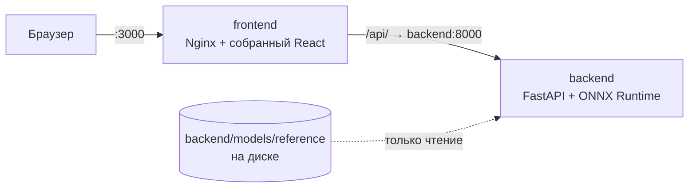

# Запуск в Docker

<p class="lead">Docker Compose поднимает два контейнера: сервер анализа на порту 8000 и сайт за Nginx на порту 3000. Веса моделей из архива подключаются в контейнер только для чтения.</p>



## Пошагово

<div class="steps" markdown>

1. **Установите Docker** с плагином Compose (на Windows и macOS — Docker Desktop) и проверьте:

    ```bash
    docker compose version
    ```

2. **Распакуйте архив DEXQ** и перейдите в папку:

    ```bash
    unzip dexq.zip
    cd dexq
    ```

3. **Запустите:**

    === "Linux / macOS"

        ```bash
        ./scripts/run.sh
        ```

        Скрипт сначала проверяет контрольные суммы всех весов и только потом вызывает `docker compose up --build`. Если веса повреждены, контейнеры не запустятся, а в консоли будет понятная причина.

    === "Windows (PowerShell)"

        ```powershell
        $env:DEXQ_MODELS_DIR = "$PWD\backend\models\reference"
        docker compose up --build
        ```

        Веса всё равно проверяются — сервер делает это сам при старте.

4. **Откройте сайт** <http://localhost:3000>. Сайт стартует после того, как сервер пройдёт проверку готовности (`healthcheck`), — обычно через 10–30 секунд после сборки.

</div>

## Проверка, что всё работает

```bash
curl http://localhost:8000/api/v1/health
```

Ожидаемый ответ:

```json
{"status": "ready", "service": "DEXQ API", "version": "0.1.0"}
```

Состояние контейнеров:

```bash
docker compose ps
```

У `backend` должен быть статус `Up (healthy)`.

## Остановка и перезапуск

| Действие | Команда |
| --- | --- |
| Остановить | ++ctrl+c++ в терминале с запуском, затем `docker compose down` |
| Запустить в фоне | `DEXQ_MODELS_DIR=$PWD/backend/models/reference docker compose up -d --build` |
| Посмотреть логи сервера | `docker compose logs -f backend` |

!!! warning "Не запускайте `docker compose up` без переменной `DEXQ_MODELS_DIR`"
    `docker-compose.yml` берёт папку с весами из `DEXQ_MODELS_DIR`. Скрипт `run.sh` выставляет её сам. При ручном запуске укажите **абсолютный** путь, иначе контейнер не увидит модели и `/health` ответит 503.

## Настройки

| Переменная | По умолчанию | Что делает |
| --- | --- | --- |
| `DEXQ_MODELS_DIR` | `backend/models/reference` | Папка с весами на хосте |
| `PYTHON` | `python3` | Python для предварительной проверки весов в `run.sh` |
| `DEXQ_MAX_UPLOAD_MB` | `50` | Максимальный размер одного файла, МБ |
| `DEXQ_MAX_ARCHIVE_MB` | `1024` | Максимальный размер ZIP-архива, МБ |

Nginx пропускает запросы до 1026 МБ и ждёт ответа сервера до 300 секунд, чтобы большой архив успел обработаться (`frontend/nginx.conf`).

## Что внутри образов

| Контейнер | Основа | Что делает |
| --- | --- | --- |
| `backend` | `python:3.12.6-slim-bookworm` (закреплён по digest) | Ставит зависимости из `requirements.lock`, запускает `uvicorn` от непривилегированного пользователя `dexq` |
| `frontend` | `node:22` для сборки → `nginx:1.27.5` | Собирает React, отдаёт статику, проксирует `/api/` на `backend:8000` |

Веса в образ не копируются — только монтируются с диска. Точные digest базовых образов — в разделе [Офлайн-поставка](offline.md).

## Windows без WSL2

Docker Desktop на Windows требует WSL2 или Hyper-V. Если они недоступны (например, в урезанной сборке Windows), запустите DEXQ внутри виртуальной машины Linux:

<div class="steps" markdown>

1. Создайте VM с Ubuntu Server 24.04 в VirtualBox: 4 ГБ ОЗУ, 2–4 ядра, сеть NAT.
2. Пробросьте порты хоста на VM: `3000 → 3000`, `8000 → 8000` и порт для SSH (например, `2222 → 22`).
3. Установите в VM Docker Engine, скопируйте туда архив DEXQ и распакуйте.
4. Внутри VM выполните `./scripts/run.sh` (при необходимости через `sudo`).
5. На Windows откройте <http://localhost:3000> — проброс портов отправит запрос в VM.

</div>

Эта схема проверена 29.09.2026: VirtualBox, Ubuntu Server 24.04.5, Docker Engine 29.8.1, Compose v5.5.1 — `backend` в статусе `Up (healthy)`, сайт отвечает HTTP 200.
