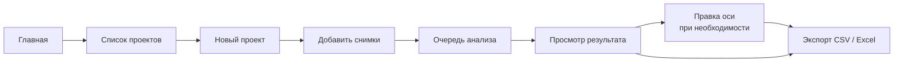
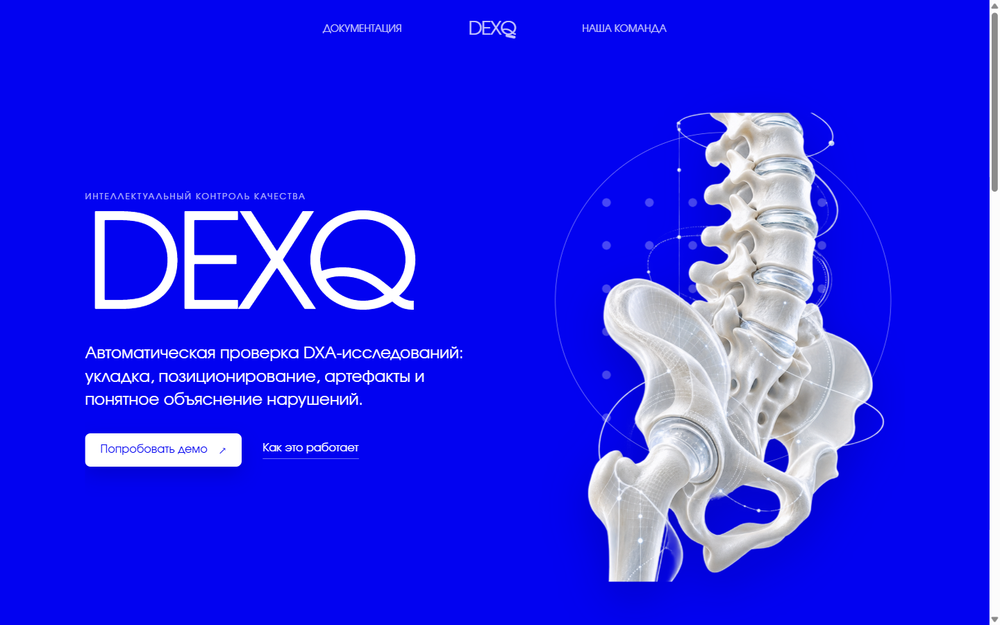

# Сайт DEXQ

Сайт — рабочее место для проверки снимков: вы создаёте проект, добавляете файлы, смотрите результат по каждому снимку и выгружаете отчёт. Эта глава показывает все экраны по порядку.

!!! info "Про скриншоты"
    На всех скриншотах — **синтетические фантомы**: картинки, нарисованные программой по форме похожими на позвоночник и бедро. Настоящие снимки пациентов в документацию не попадают. Поэтому изображения выглядят схематично, а вердикты на них нужны только для иллюстрации интерфейса.

## Путь пользователя

-   :material-folder-multiple-outline:{ .lg .middle } **[Проекты и загрузка](projects.md)**

    ---

    Создание проекта, какие файлы можно добавлять, ограничения по количеству и размеру.

-   :material-view-dashboard-outline:{ .lg .middle } **[Рабочее пространство](workspace.md)**

    ---

    Список снимков, просмотрщик, панель результата, меню и очередь обработки.

-   :material-vector-line:{ .lg .middle } **[Ручная ось](manual-axis.md)**

    ---

    Как поправить найденную ось позвоночника и сохранить правку для отчёта врача.

-   :material-file-table-outline:{ .lg .middle } **[Экспорт отчётов](export.md)**

    ---

    Два вида выгрузки: для организаторов (8 полей задания) и отчёт врача с правками.

## Главная страница

<figure markdown>

<figcaption>Главная страница. Кнопка «Попробовать демо» ведёт к списку проектов, «Как это работает» — к описанию решения. В шапке — ссылки на документацию API и страницу команды.</figcaption>
</figure>

## Важно знать заранее

- **Данные живут только во вкладке.** Проекты, результаты и правки хранятся в памяти текущей вкладки браузера. Переходы внутри сайта их сохраняют, но обновление страницы или закрытие вкладки удаляет всё. Выгрузите отчёт до того, как закроете сайт.
- **Снимки не уходят в интернет.** Файлы отправляются только на ваш локальный сервер DEXQ и не записываются в постоянное хранилище браузера.
- **Это не диагноз.** Каждый результат сопровождается пометкой «Исследовательский контроль качества, не диагностика» — окончательное решение за специалистом.
