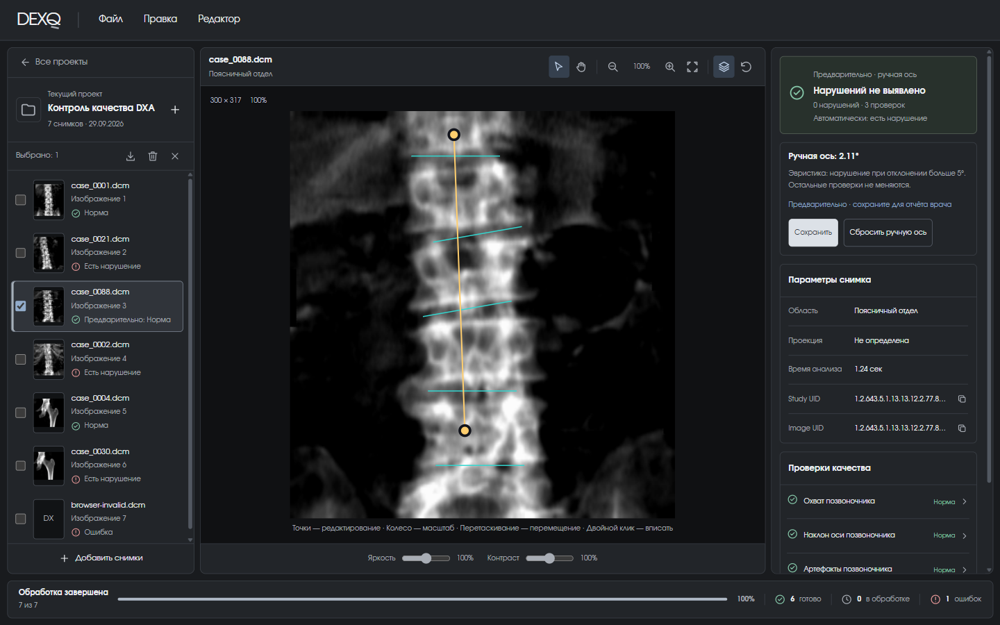

# Ручная ось позвоночника

Модель находит центры позвонков и строит ось через верхний и нижний. Если специалист видит, что точки стоят неточно, их можно передвинуть — DEXQ пересчитает угол и покажет, как меняется вердикт.

<figure markdown>

<figcaption>Модель поставила ось с наклоном 5,3° — чуть выше порога 5°. Нижняя точка перенесена на центр нижнего позвонка: ручной угол — 2,11°, предварительный итог — «Нарушений не выявлено». Автоматический результат («есть нарушение») показан строкой ниже для сравнения.</figcaption>
</figure>

## Как поправить ось

1. Откройте снимок позвоночника. Инструмент редактирования ориентиров :material-cursor-default-outline: включён по умолчанию.
2. **Перетащите** верхнюю или нижнюю точку мышью. Для точной подстройки щёлкните по точке и двигайте её стрелками — шаг 1 пиксель исходного снимка.
3. Следите за правой панелью: там появится блок **«Ручная ось: N°»**, а итог и проверка наклона помечены как **предварительные**.
4. Нажмите **«Сохранить»**, чтобы правка попала в отчёт врача. Статус сменится на «Сохранено в проекте · учитывается в отчёте врача».

Чтобы вернуть автоматическую ось, нажмите **«Сбросить ручную ось»**.

## Что меняет правка, а что — нет

| Меняется | Не меняется |
| --- | --- |
| Угол оси и проверка «Наклон оси позвоночника» | Проверки «Охват позвоночника» и «Артефакты позвоночника» |
| Итог снимка в интерфейсе и **отчёте врача** | Отчёт **для организаторов** — там всегда автоматический результат |
| — | Ответ модели, её пороги и данные на сервере |

!!! warning "Ручной угол — эвристика"
    Правило простое: угол между осью и вертикалью больше 5° — нарушение. Оно не обучалось и не проверялось клинически. Пометка «эвристика» есть и в интерфейсе, и в отчёте врача (`assessment_source = manual_axis_heuristic`).

## Отмена и повтор

Каждое перетаскивание — одна операция в истории снимка.

| Действие | Клавиши | Меню |
| --- | --- | --- |
| Отменить правку оси | ++ctrl+z++ | Правка → Отменить правку оси |
| Повторить правку оси | ++ctrl+y++ или ++ctrl+shift+z++ | Правка → Повторить правку оси |

Сброс оси тоже можно отменить. На macOS вместо ++ctrl++ используйте ++cmd++.

Если отмена, повтор или сброс изменили уже сохранённую ось, снимок снова станет предварительным — не забудьте нажать «Сохранить». При экспорте отчёта врача DEXQ напомнит о несохранённых правках.

## Когда правка недоступна

Точки можно двигать только на снимке позвоночника, где модель нашла **обе** точки оси. Сервер правки не хранит: они живут в проекте во вкладке браузера и пропадут вместе с ней, если не выгрузить отчёт.
