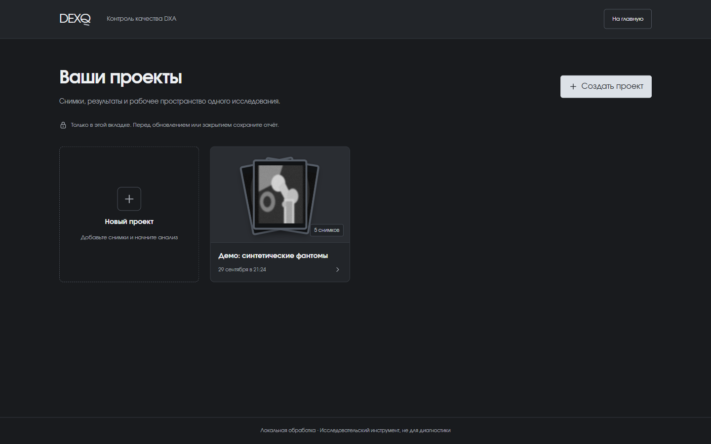
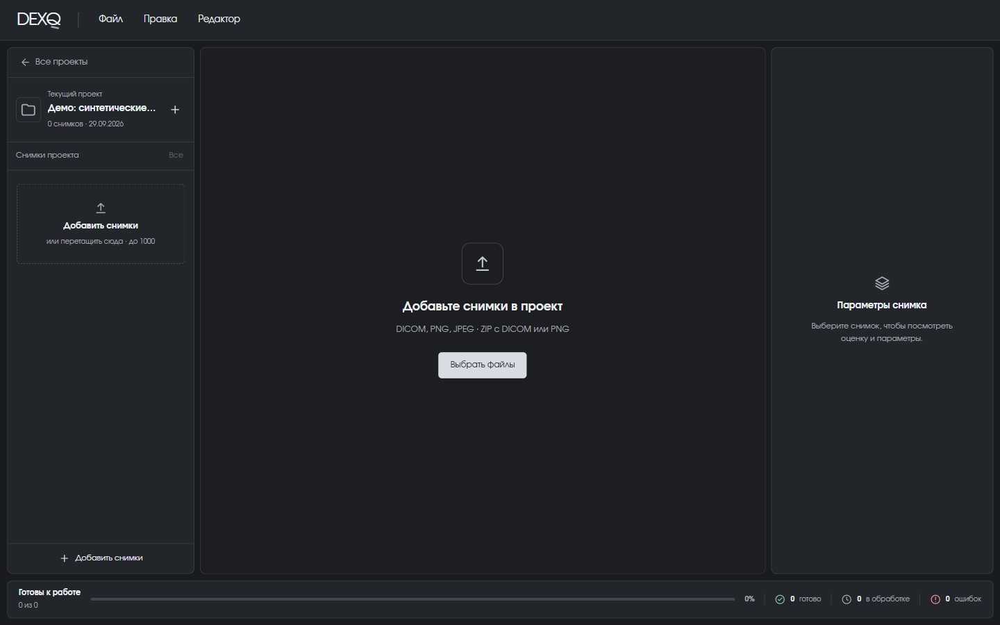

# Проекты и загрузка

Проект — это папка для одной серии снимков: например, одного исследования или набора для проверки. У каждого проекта свой список файлов, своя очередь обработки и свой отчёт.

## Список проектов

<figure markdown>

<figcaption>Список проектов. На карточке — миниатюры снимков, их количество и время создания.</figcaption>
</figure>

Чтобы создать проект, нажмите **«Создать проект»** или пунктирную карточку **«Новый проект»**, введите название и подтвердите. Сразу после этого откроется пустое рабочее пространство.

<figure markdown>

<figcaption>Пустой проект: файлы можно выбрать кнопкой или перетащить в окно.</figcaption>
</figure>

## Как добавить снимки

Есть три способа:

1. кнопка **«Выбрать файлы»** в центре пустого проекта;
2. кнопка **«Добавить снимки»** внизу левой панели или **Файл → Добавить снимки…**;
3. перетащить файлы мышью в левую панель или в область просмотра.

Новые файлы **добавляются** к уже загруженным, а не заменяют их. Анатомическая область (позвоночник или бедро) определяется автоматически — выбирать её вручную не нужно.

## Какие файлы подходят

| Формат | Поддержка |
| --- | --- |
| DICOM (`.dcm`, `.dicom`) | Основной формат. Одноканальное 8-битное изображение `MONOCHROME2` |
| PNG | Для технической демонстрации: изображение в оттенках серого |
| JPEG (`.jpg`, `.jpeg`) | Одиночные файлы переводятся в PNG прямо в браузере. JPEG внутри ZIP не поддерживается |
| ZIP | Архив с DICOM или PNG. Добавляйте отдельно от обычных файлов |

## Ограничения

| Что | Предел |
| --- | --- |
| Снимков в одном проекте | 1000 (включая содержимое ZIP) |
| Один файл | 50 МБ |
| ZIP-архив | 1024 МБ в сжатом виде, 2 ГБ после распаковки, до 1000 изображений |

!!! note "Сколько ждать"
    На ноутбуке с Intel Core i7-1355U исследование из 1–3 снимков обрабатывается в среднем за 4,3 с, максимум — 15,9 с. Проект из 1000 снимков на разном оборудовании не замерялся, поэтому точное время для него не гарантируем.
