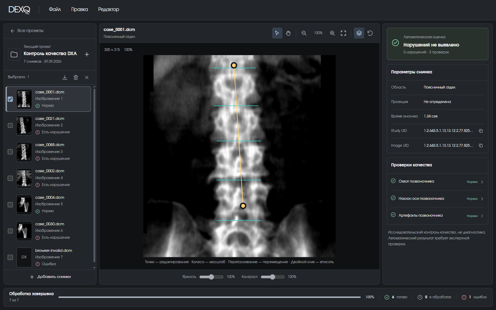
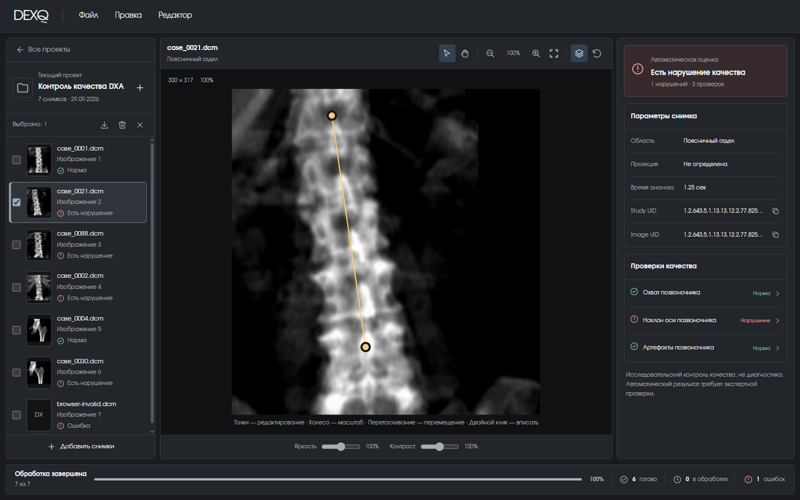
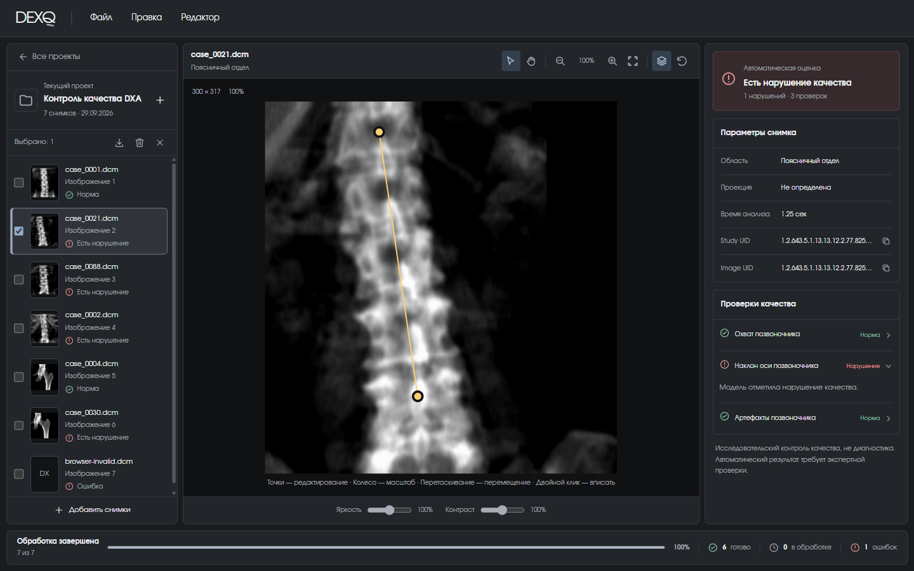
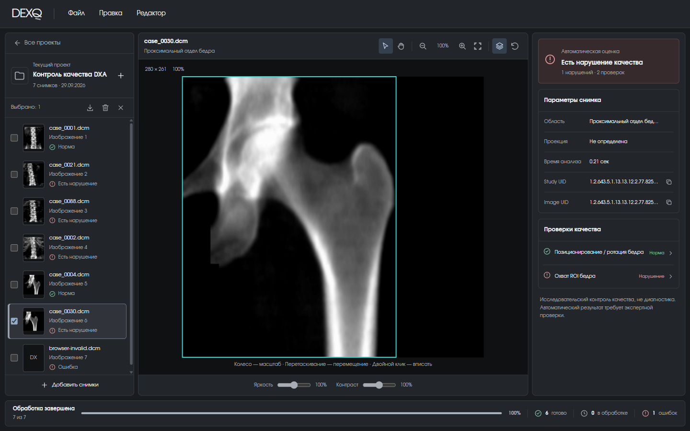
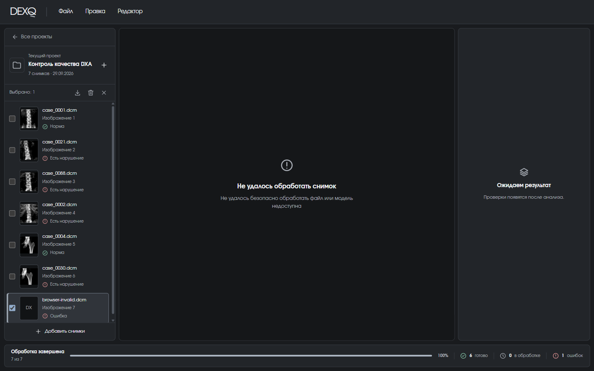
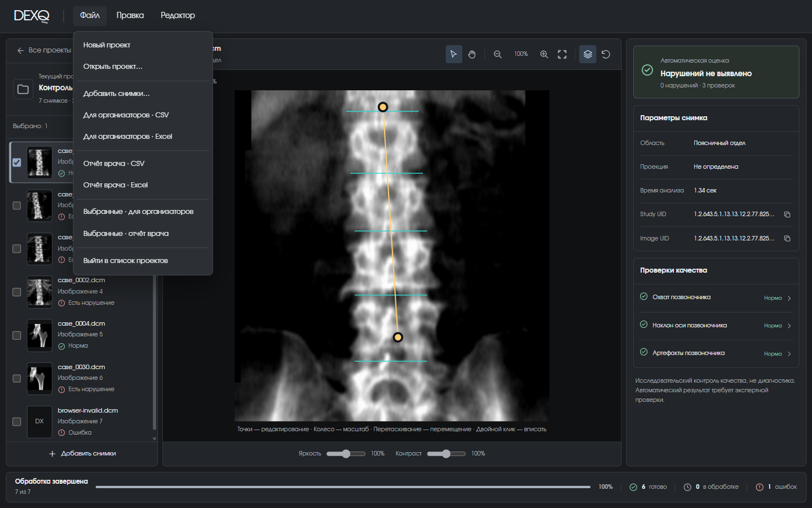
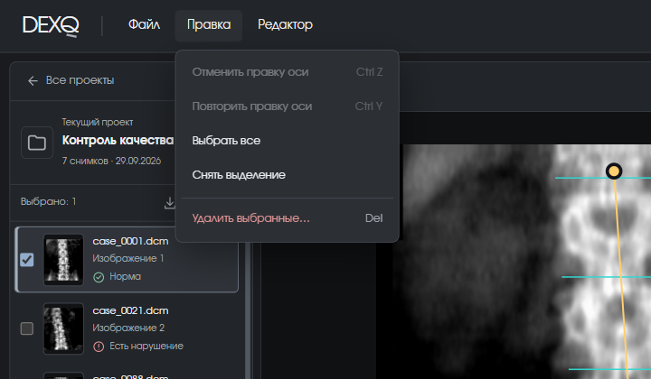
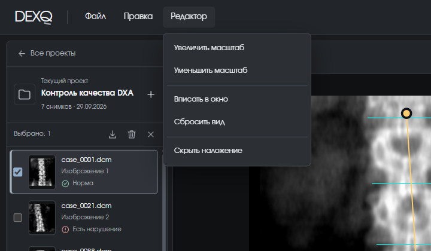

# Рабочее пространство

Главный экран DEXQ. Он разделён на три колонки и строку прогресса внизу.

<figure markdown>

<figcaption>Снимок поясничного отдела без нарушений (ось отклонена на 3,7°): зелёная плашка «Нарушений не выявлено», все три проверки позвоночника — «Норма».</figcaption>
</figure>

| Зона | Что в ней |
| --- | --- |
| **Левая панель** | Название проекта, список снимков со статусами, кнопка «Добавить снимки» |
| **Центр** | Просмотрщик снимка с найденными ориентирами, инструменты масштаба, яркость и контраст |
| **Правая панель** | Итог, параметры снимка и результат каждой проверки |
| **Нижняя строка** | Прогресс обработки проекта: сколько готово, в работе и с ошибкой |

## Статусы снимков

| В списке | Значение |
| --- | --- |
| Норма | Все проверки пройдены, нарушений не найдено (`quality_class = 0`) |
| Есть нарушение | Хотя бы одна проверка нашла нарушение (`quality_class = 1`) |
| Ошибка | Файл не удалось обработать (`Failure`), итог не выставлен |
| Предварительно: … | Вы подвинули ось, но ещё не сохранили правку |
| В очереди / Анализируется | Снимок ждёт или обрабатывается прямо сейчас |

## Снимок с нарушением

<figure markdown>

<figcaption>Ось позвоночника отклонена на 8,3° — больше порога 5°. Итог «Есть нарушение качества», проверка «Наклон оси позвоночника» — «Нарушение».</figcaption>
</figure>

Жёлтая линия с двумя точками — ось, которую нашла модель по центрам верхнего и нижнего позвонков. Щёлкните по проверке в правой панели, чтобы раскрыть её пояснение:

<figure markdown>

<figcaption>Раскрытая проверка. Если ось найдена неточно, её можно поправить вручную — см. <a href="../manual-axis/">Ручная ось</a>.</figcaption>
</figure>

## Снимок бедра

<figure markdown>

<figcaption>Для бедра выполняются две проверки. Здесь ротация в норме, но охват ROI нарушен. Бирюзовая рамка — граница светлой области снимка, а не анатомическая маска.</figcaption>
</figure>

!!! note "Ограничения проверок бедра"
    - «Позиционирование / ротация бедра» — **один общий флаг**: система не различает, что именно не так — укладка или поворот ноги.
    - Ручных точек для бедра нет: модель не выдаёт анатомических ориентиров, которые можно было бы двигать.

## Ошибка обработки

<figure markdown>

<figcaption>Файл с расширением <code>.dcm</code>, который на самом деле не является DICOM, получил статус «Ошибка». Остальные снимки проекта обработаны как обычно.</figcaption>
</figure>

Ошибка одного файла не останавливает очередь и не влияет на соседние снимки. В отчёт такой файл тоже попадёт — со статусом `Failure` и пустым классом.

## Параметры снимка

| Поле | Откуда берётся |
| --- | --- |
| Область | Определяет модель-роутер по изображению |
| Проекция | Только из DICOM-тега `ViewPosition` (AP или PA). Если тега нет — «Не определена». По изображению проекция не определяется |
| Время анализа | Сколько сервер обрабатывал файл |
| Study UID, Image UID | Идентификаторы исследования и снимка из DICOM. Кнопка справа копирует значение |

## Просмотрщик

| Действие | Как |
| --- | --- |
| Масштаб | Колесо мыши (относительно курсора) или кнопки :material-magnify-minus-outline: :material-magnify-plus-outline: |
| Перемещение | Перетаскивание инструментом «рука», правой или средней кнопкой мыши |
| Вписать снимок в окно | Двойной клик или кнопка :material-fit-to-screen-outline: |
| Показать / скрыть ориентиры | Кнопка слоёв :material-layers-outline: или **Редактор → Показать/Скрыть наложение** |
| Сбросить вид | Кнопка :material-restore: — возвращает масштаб, яркость, контраст и наложение, но **не** сбрасывает ручную ось |
| Яркость и контраст | Ползунки под снимком |

## Меню

<figure markdown>

<figcaption>Файл: проекты, добавление снимков и все виды экспорта.</figcaption>
</figure>

<figure markdown>

<figcaption>Правка: отмена и повтор правок оси, выделение и удаление снимков.</figcaption>
</figure>

<figure markdown>
{ width="620" }
<figcaption>Редактор: масштаб, вписывание, сброс вида и наложение ориентиров.</figcaption>
</figure>

Когда одно меню открыто, наведение на соседнее переключает на него. По меню можно ходить стрелками, ++esc++ закрывает.

## Выделение и удаление

- Чекбокс или клик по снимку — выбрать один.
- ++ctrl++ + клик — добавить или убрать снимок из выделения.
- ++shift++ + клик — выбрать диапазон.
- Рамка мышью в левой панели — выбрать несколько подряд.

Над списком появится панель «Выбрано: N» с кнопками экспорта, удаления и снятия выделения. Удаление (++del++ или **Правка → Удалить выбранные…**) спрашивает подтверждение и убирает снимки только из проекта — файлы на вашем компьютере остаются.

## Очередь обработки

Снимки анализируются по одному в порядке добавления. Строка внизу показывает общий прогресс; проценты во время работы приблизительные, 100% появляются только после завершения. Кнопка **«Пауза»** останавливает очередь после текущего снимка, **«Продолжить»** — возобновляет. Очередь продолжает работать, даже если вы вернулись в список проектов.

Ширину боковых панелей можно менять, перетаскивая разделители; двойной клик по разделителю возвращает ширину по умолчанию.
